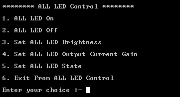

# NXP Application Code Hub

## PCA9957HN led driver with demo app running on FRDM-MCXN947 or FRDM-MCXA153

PCA9957 is a daisy-chain SPI-compatible 4-wire serial bus controlled 24-channel constant current LED driver optimized for dimming and blinking 32 mA Red/Green/Blue/Amber (RGBA) LEDs.

This demo application provides a command line interface which allows the user to easily explore the different functions of the driver to use the LED controller features for color mixing, group gradation, blinking and dimming LEDs.

### PCA9957 Block Diagram

### Key Features of PCA9957 LED Driver
- 24 LED drivers. Each output programmable at:
  - Off
  - On
  - 8 bits programmable LED brightness
  - 8 bits programmable group dimming/blinking mixed with individual LED brightness
  - Programmable LED output delay to reduce EMI and surge currents

- Gradation control for all channels
  - Each channel can be assigned to one of six gradation control groups
  - Programmable gradation time and rate for ramp-up and/or ramp-down operations
  - Programmable step time (6-bit) from 0.5 ms (minimum) to 512 ms (maximum)
  - Programmable hold-on time after ramp-up and hold-off time after ramp-down (3-bit) from 0 s to 6 s
  - Programmable final ramp-up and hold-on current
  - Programmable brightness current output adjustment, either linear or exponential curve
- Open/short load/overtemperature detection mode to detect individual LED errors
- 256-step (8-bit) linear programmable brightness per LED output varying from fully off     (default) to maximum brightness fully ON using a 31.25 kHz PWM signal
- 256-step group brightness control allows general dimming (using a 122 Hz PWM signal) from fully off to maximum brightness (default)
- 256-step group blinking with frequency programmable from 15 Hz to 16.8 s and duty cycle from 0 % to 99.6 %
- Active LOW Output Enable (OE) input pin allows for hardware blinking and dimming of the LEDs

#### Boards: FRDM-MCXN947, FRDM-MCXA153
#### Categories: User Interface
#### Peripherals: SPI
#### Toolchains: MCUXpresso IDE

## Table of Contents
1. [Software](#step1)
2. [Hardware](#step2)
3. [Setup](#step3)
4. [Test Application Steps](#step4)
5. [Know Limitations](#step5)
6. [FAQs](#step6) 
7. [Support](#step7)
8. [Release Notes](#step8)

## 1. Software
- [IoT Sensing SDK (ISSDK) v1.8](https://nxp.com/iot-sensing-sdk) offered as middleware in MCUXpresso SDK for supported platforms
- [MCUXpresso IDE v11.9.0](https://www.nxp.com/design/design-center/software/development-software/mcuxpresso-software-and-tools-/mcuxpresso-integrated-development-environment-ide:MCUXpresso-IDE)

## 2. Hardware
- FRDM-MCXN947 and FRDM-MCXA153 MCU board
- [PCA9959HN LED Driver](https://www.nxp.com/part/PCA9957HN#/) 
- Personal Computer
- Mini/micro C USB cable

## 3. Setup
### 3.1 Step 1: Download and Install required Software(s)
- Install MCUXpresso IDE 11.9.0
- Download and Install [MCUXpresso SDK v2.14.0 for FRDM-MCXN947](https://mcuxpresso.nxp.com/en/builder?hw=FRDM-MCXN947). Make sure to select ISSDK  middleware while building SDK.
- Download and Install [MCUXpresso SDK v2.14.2 for FRDM-MCXA153](https://mcuxpresso.nxp.com/en/builder?hw=FRDM-MCXA153). Make sure to select ISSDK  middleware while building SDK.
- Install Git v2.39.0 (for cloning and running west commands).
- Install Putty/Teraterm for UART.
 
### 3.2 Step 2: Clone the APP-CODE-HUB/dm-pca9957hn-led-driver-with-demo-app
- Clone this repository to get the example projects:
- Change directory to cloned project folder: 
    cd *dm-pca9957hn-led-driver-with-demo-app*
 
**Note:** If you are using Windows to clone the project, then please configure filename length limit using below command
**git config --system core.longpaths true**
 
### 3.3 Step 3: Build example projects
- Open MCUXpresso IDE and select a directory to create your workspace.
- Install MCXUpresso SDK 2.14.x for FRDM-MCX947, FRDM-MCXA153 (drag and drop SDK zip into "Installed SDK" view) into MCUXpresso IDE.
- Go to "Quickstart Panel" and click on "Import Project(s) from file system",
- Select "Project directory (unpacked)" and browse to the cloned project folder.
- Select example projects that you want to open and run.
- Right click on project and select build to start building the project.
## 4. Test Application Steps
- User need to check COM port after connecting USB cable between Host PC and Target Board via device manager.

- Open PUTTY/Teraterm application installed on your Windows PC with Baudrate 115200 and assigned COM port as mentioned in above step.

- After right click on project and select "Debug As", Demo application will run in interactive mode. When the demo runs successfully, you can see the logs printed on the terminal.

## 4.1 Logs Results

**Main Menu will look like this**

**Enter #1 to Start LED Control** 

   - Features provided by ALL LED control option sub-menu:
     - Turn on all LEDs
     - Turn off all LEDs
     - Set Brightness of all LED
     - Set LED Output Current gain of all LED
     - Set State of all LEDs

   - Settings for LED channel output state:
     - On State
     - Off State
     - Individual LEDs Brightness control 
     - Individual LEDs Brightness and group dimmming/blinking control

   - Its complusory to configure the states of LEDs before proceeding with LED control operations (By default its Individual LEDs Brightness control).
     
**Enter #2 to perform Individual LED Control features** 

   - Features provided by Individual LEDs control sub-menu:
     - Turn on Individual LEDs
     - Turn off Individual LEDs
     - Set Brightness of Individual LEDs
     - Individual LED Output Current gain
     - Set Individual LED State
   
   - Settings for LED channel output state:
     - On State
     - Off State
     - Individual LEDs Brightness control
     - Individual LEDs Brightness and group dimmming/blinking control

   - Its complusory to configure the states of LEDs before proceeding with Individual LED control operations (By default its Individual LEDs Brightness control).
   - The only difference here is ,CLI application will ask user to give the specfic LED number before performing any action. 

**Enter #3 to perform the Dimming blinking features on LEDs** 
   - Before performing Dimming/Blinking , its complusory to set the state of LED as "All/Individual LED brightness and group dimming/blinking" from #1 and #2 options. 
   - Make sure LED channel should be turned on for performing Dimming/Blinking.
   - All listed options under Dimming/Blinking Control is shown in Figure.

**Enter #4 to Perform Gradation Features On LEDs:**  
   - Gradation menu looks like this: 

   - Gradation configuration:
     - Enter sub-option #1 for Gradation Configuration.
     - Enter Group number to perform gradation on it.
     - Do all Mentioned configurations listed in below figure.

   - Assign LED to Gradation Group
     - Assign LED from another group to the selected gradation group.

   - Enable LED Channel for Gradation
     - LED Channel can be selected as ALL/Individual as per the Gradation choice for LEDs. 

   - Note: Other Options are Disable, Start and Stop Gradation.

**Enter #5 to Perform System RESET On LEDs:** 
  
   - All registers settings on device will get reset after perfoming RESET. 

   Note: When a reset of PCA9957 is activated using an active LOW input on the RESET pin, a reset pulse width of 2.5 μs minimum is required.

**Enter #6 to set LED output Delay** 
  
   - Used to set turn on delay between LED outputs.
   - 0 for no delay at all.
   - 1 for Delay to 1 clock cycle, 2 for delay of 2 clock cycles etc.

**Enter #7 to Perform Sleep Control on LEDs :** 

   - Once sleep mode is enabled on device the currently glowing LEDs will go on sleep mode and once sleep is disabled all configured LEDs (Dimming/Blinking , Gradation ,LED On/Off) will get retrieved as set by user.

**Options #8 , 9, 10, 11 use to check features like Maximum Current , LED Error and  Under/Over Temperature Control on device :** 

  - **Auto sleep off On Error control** feature will ensure that if any fault occurred on LED Chennels, it will automatically turn off that particular LED channel , so that it does not impact other channels.

  - Maximun current control is used to set:
    - 30mA current for LED driver 
    - 20mA current for LED driver
  

  - LED Error Feature is used to check these two conditions:
    - Open Cirucit Condition
    - Short Cirucit Condition
  - Check any Error (if occurred)
  - Clear Errors (if any)
  - Check Individual LED errors by giving LED number as input.

 
  - Over Temerature Check feature will check the current temperature , it measures the over and under temperature conditions and display the message accordingly.
  - If working under control it shows, **Operating in under temperature**.

## 5. Know Limitations

 - PCA9957HN-ARD sometimes detects faults (short circuit) on different LED channels when supply given by base board so It is recommended to use external supply (3V - 3.3V) on J1 (To use external supply Please connect pin number 2 and 3 of J2).
 - Use Stackable Female Header Connector to connect base and shield board, so it gets stacked properly. 

## 6. FAQs
*Include FAQs here if appropriate. If there are none, then state "No FAQs have been identified for this project".*

## 7. Support
*Provide URLs for help here.*

#### Project Metadata
<!----- Boards ----->
 

<!----- Categories ----->

<!----- Peripherals ----->

<!----- Toolchains ----->

Questions regarding the content/correctness of this example can be entered as Issues within this GitHub repository.

>**Warning**: For more general technical questions regarding NXP Microcontrollers and the difference in expected funcionality, enter your questions on the [NXP Community Forum](https://community.nxp.com/)

## 8. Release Notes
| Version | Description / Update                           | Date                        |
|:-------:|------------------------------------------------|----------------------------:|
| 1.0     | Initial release of PCA9957-HN with FRDM-MCXN947 AND MXCA153  on Application Code Hub  | 24 Mayth 2024 |

